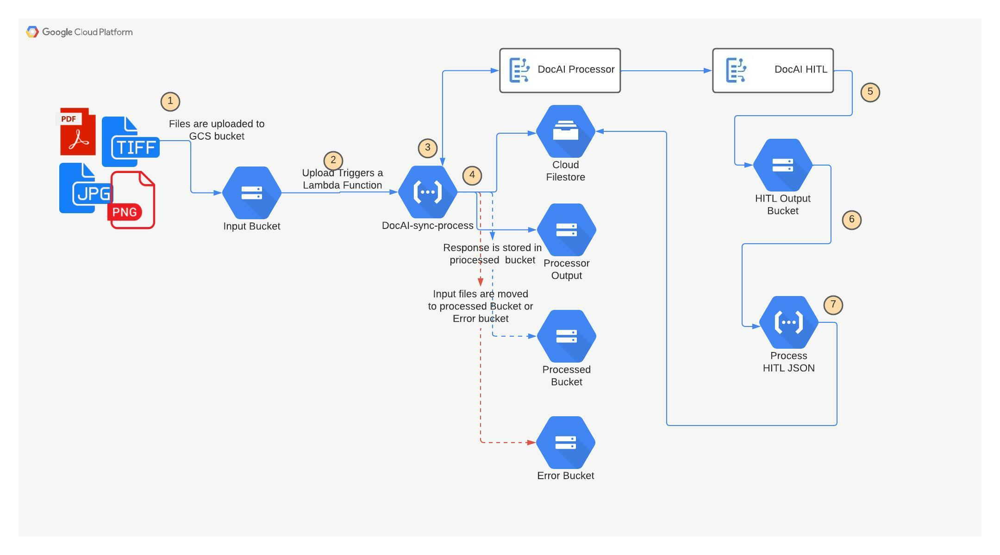

# documentai-poc-in-a-box

DocumentAI POC-in-a-box provides a managed Pipeline that  includes components to call, DocAI processors, queue HITL tasks, compare extraction to HITL validated data, generate metrics(accuracy & F1 score) & dashboard to establish accuracy at the field level.  This provides important statistics to either determine the baseline accuracy or help evaluate success criteria for a given POC.It also included terraform manifest files to quickly deploy the pipeline in your own GCP account

### Google Cloud services used

- Google Cloud Document AI
- Google Cloud Functions
- Google Cloud Build
- Google Cloud Firestore
- Google Cloud Storage

### Architecture



1. Upload Files in input bucket.
2. Creation of files triggers DocAI-sync-process cloud function.
3. Cloud Function calls DocumentAI synchronous endpoint and writes extracted data to Cloud Firestore Collection. 
4. Files are moved from input bucket to processed or error bucket depending on successful or failed execution.
5. Once documents are processed in Human-in-the-loop(HITL), output JSON is written to HITL output bucket.
6. Creation of HITL json files triggers Process-HITL-JSON cloud function which parses and writes data into Cloud Firestore collection.

### Prerequisites
1. Create a DocumentAI processor in GCP console and make note of processor_id.
2. create a GCP bucket with name as {GCP Project Name}-dai-hitl-output.
3. Configure HITL for the processor created in step 1 & setup output location to bucket created in step 2.

### Deployment
1. Login to GCP console. Make sure you are in the
2. Clone the github repo
```shell
git clone https://github.com/HSbedi87/documentai-poc-in-a-box.git
```
2. navigate to documentai-poc-in-a-box/terraform folder
```shell
cd documentai-poc-in-a-box/terraform/
```
3. Update values of the following in terraform/variable.tf file.
   1. project - project_id
   2. region - GCP region
   3. docai-processor-id - processor_id of processor created in step 1 under prerequisites.
   4. docai-processor-region - region of the processor created in step 1 under prerequisites.
4. Init Terraform provider
```shell
terraform init
```
5. Execute terraform apply and review change of components in the plan. When prompted enter "yes" to deploy infrastructure.
```shell
terraform apply
```

### Clean-up
Execute terraform destroy and review change of components in the plan. When prompted enter "yes" to destroy infrastructure.
```shell
terraform destroy
```
Note: Google cloud storage buckets that contain files will need to be manually removed.